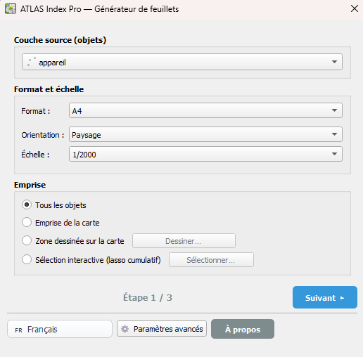
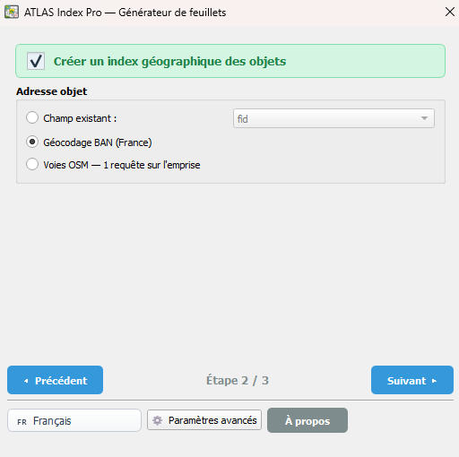
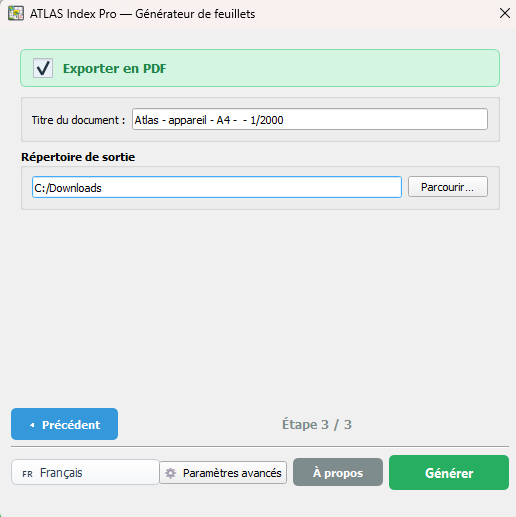

<div align="center">

# ATLAS Index Pro


**Générateur de feuillets atlas pour QGIS — avec index géographique et export PDF complet**

[](https://qgis.org)
[](CHANGELOG.md)
[](LICENSE)
[](README.md)

</div>

---

<div align="center">

## Aperçu rapide · Quick Overview

| Étape 1 — Lancer et configurer | Étape 2 — Générer la grille | Étape 3 — Exporter en PDF |
|:---:|:---:|:---:|
|  |  |  |
| Sélectionnez votre couche vecteur,<br>choisissez le format et l'échelle | La grille de feuillets est créée<br>et ajoutée au projet QGIS | PDF complet généré : garde,<br>index, plan, feuillets liés |

</div>

---

## Français

### Description

**ATLAS Index Pro** est un plugin QGIS qui génère automatiquement une grille de feuillets atlas (A4/A3, portrait/paysage, multi-échelles) à partir de n'importe quelle couche vecteur, avec index géographique des objets, plan d'ensemble et export PDF complet en un clic.

Fini les mises en page manuelles : définissez votre emprise, choisissez votre format de papier et votre échelle — le plugin crée la grille, numérotote les feuillets, génère l'index, et exporte le tout en PDF avec liens hypertexte entre l'index et les feuillets.

### Fonctionnalités

- **Grille de feuillets automatique** : A4 ou A3, portrait ou paysage, à l'échelle souhaitée, générée à partir de l'emprise d'une couche vecteur
- **Index géographique** : liste paginée des objets de la couche avec renvoi vers le numéro de feuillet correspondant
- **Plan d'ensemble** : carte de synthèse positionnant tous les feuillets dans leur contexte géographique
- **Export PDF complet** : page de garde, index, plan d'ensemble, feuillets atlas — tout en un seul fichier PDF
- **Liens hypertexte** : depuis chaque référence de l'index, un clic amène directement à la page du feuillet dans le PDF
- **Géocodage intégré** : recherche et localisation d'adresses dans l'interface
- **Outils de sélection** : lasso et rectangle pour sélectionner des objets directement sur la carte
- **Paramètres avancés** : recouvrement des feuillets, marge autour des objets, résolution DPI
- **Interface multilingue** : basculez entre FR / EN / ES / PT / DE sans redémarrer

### Installation

1. Téléchargez ou clonez ce dépôt :

   ```bash
   git clone https://github.com/Cartoyoyo/ATLAS_Index_Pro.git
   ```

2. Copiez le dossier `ATLAS_Index_Pro` dans le répertoire des plugins QGIS :

   | Système | Chemin |
   |---------|--------|
   | Windows | `C:\Users\<utilisateur>\AppData\Roaming\QGIS\QGIS3\profiles\default\python\plugins\` |
   | macOS   | `~/Library/Application Support/QGIS/QGIS3/profiles/default/python/plugins/` |
   | Linux   | `~/.local/share/QGIS/QGIS3/profiles/default/python/plugins/` |

3. Ouvrez QGIS, allez dans **Extensions → Installer/Gérer les extensions**, cochez **ATLAS Index Pro** et cliquez sur **OK**.

4. Une icône apparaît dans la barre d'outils et un menu **ATLAS Index Pro** est ajouté.

### Utilisation

**Étape 1 — Lancer et configurer**


1. **Lancez le plugin** via la barre d'outils ou le menu **ATLAS Index Pro**.
2. **Sélectionnez votre couche vecteur** de référence (ex. : réseau de conduites, bâtiments, voirie...).
3. **Choisissez le format de feuillet** : A4 ou A3, portrait ou paysage.
4. **Définissez l'échelle** souhaitée pour les feuillets.
5. **Configurez les paramètres avancés** si besoin : recouvrement, marge, DPI.

**Étape 2 — Générer la grille**


6. Cliquez sur **Générer la grille** : la couche de feuillets est créée et ajoutée au projet.

**Étape 3 — Exporter en PDF**


7. Cliquez sur **Exporter en PDF** pour obtenir le document complet avec index et liens hypertexte.

---

## English

### Description

**ATLAS Index Pro** is a QGIS plugin that automatically generates an atlas sheet grid (A4/A3, portrait/landscape, multi-scale) from any vector layer, with a geographic object index, overview map, and full PDF export in one click.

No more manual print layouts: define your extent, choose your paper format and scale — the plugin creates the grid, numbers the sheets, generates the index, and exports everything as a PDF with hyperlinks between the index and the sheets.

### Features

- **Automatic sheet grid**: A4 or A3, portrait or landscape, at the desired scale, generated from a vector layer extent
- **Geographic index**: paginated list of layer objects with reference to the corresponding sheet number
- **Overview map**: summary map showing all sheets in their geographic context
- **Full PDF export**: cover page, index, overview map, atlas sheets — all in a single PDF file
- **Hyperlinks**: from each index reference, one click navigates directly to the sheet page in the PDF
- **Built-in geocoder**: address search and location within the interface
- **Selection tools**: lasso and rectangle to select features directly on the map
- **Advanced settings**: sheet overlap, object margin, DPI resolution
- **Multilingual interface**: switch between FR / EN / ES / PT / DE without restarting

### Installation

1. Download or clone this repository:

   ```bash
   git clone https://github.com/Cartoyoyo/ATLAS_Index_Pro.git
   ```

2. Copy the `ATLAS_Index_Pro` folder to your QGIS plugins directory:

   | OS | Path |
   |----|------|
   | Windows | `C:\Users\<username>\AppData\Roaming\QGIS\QGIS3\profiles\default\python\plugins\` |
   | macOS   | `~/Library/Application Support/QGIS/QGIS3/profiles/default/python/plugins/` |
   | Linux   | `~/.local/share/QGIS/QGIS3/profiles/default/python/plugins/` |

3. Open QGIS, go to **Plugins → Manage and Install Plugins**, check **ATLAS Index Pro** and click **OK**.

4. An icon appears in the toolbar and an **ATLAS Index Pro** menu is added.

### Usage

**Step 1 — Launch and configure**


1. **Launch the plugin** from the toolbar or the **ATLAS Index Pro** menu.
2. **Select your reference vector layer** (e.g. pipe network, buildings, roads...).
3. **Choose the sheet format**: A4 or A3, portrait or landscape.
4. **Set the scale** for the atlas sheets.
5. **Configure advanced settings** if needed: overlap, margin, DPI.

**Step 2 — Generate the grid**


6. Click **Generate grid**: the sheet layer is added to the project.

**Step 3 — Export to PDF**


7. Click **Export to PDF** to get the complete document with index and hyperlinks.

---

## Español

### Descripción

**ATLAS Index Pro** es un plugin de QGIS que genera automáticamente una cuadrícula de hojas de atlas (A4/A3, vertical/horizontal, multiescala) a partir de cualquier capa vectorial, con índice geográfico de objetos, mapa de conjunto y exportación PDF completa en un clic.

> Las capturas de pantalla del flujo de trabajo se encuentran en la sección [Aperçu rapide](#aperçu-rapide--quick-overview) al inicio de este documento.

### Funcionalidades

- **Cuadrícula de hojas automática**: A4 o A3, vertical u horizontal, a la escala deseada
- **Índice geográfico**: lista paginada de objetos con referencia al número de hoja correspondiente
- **Mapa de conjunto**: mapa resumen con todas las hojas en su contexto geográfico
- **Exportación PDF completa**: portada, índice, mapa de conjunto, hojas de atlas — todo en un único archivo PDF
- **Hipervínculos**: desde el índice, un clic lleva directamente a la página de la hoja en el PDF
- **Geocodificador integrado**, **herramientas de selección** (lazo y rectángulo), **parámetros avanzados** (solapamiento, margen, DPI)
- **Interfaz multilingüe**: FR / EN / ES / PT / DE

### Instalación

1. Descargue o clone el repositorio y copie la carpeta `ATLAS_Index_Pro` en el directorio de plugins de QGIS.
2. En QGIS: **Complementos → Administrar e instalar complementos**, active **ATLAS Index Pro**.

---

## Português

### Descrição

**ATLAS Index Pro** é um plugin QGIS que gera automaticamente uma grade de folhas de atlas (A4/A3, retrato/paisagem, multiescala) a partir de qualquer camada vetorial, com índice geográfico de objetos, mapa geral e exportação PDF completa com um clique.

> As capturas de ecrã do fluxo de trabalho estão disponíveis na secção [Aperçu rapide](#aperçu-rapide--quick-overview) no início deste documento.

### Funcionalidades

- **Grade de folhas automática**: A4 ou A3, retrato ou paisagem, na escala desejada
- **Índice geográfico**: lista paginada de objetos com referência ao número de folha correspondente
- **Mapa geral**: mapa resumo com todas as folhas no seu contexto geográfico
- **Exportação PDF completa**: capa, índice, mapa geral, folhas de atlas — tudo num único ficheiro PDF
- **Hiperligações**: a partir do índice, um clique leva diretamente à página da folha no PDF
- **Geocodificador integrado**, **ferramentas de seleção** (laço e retângulo), **parâmetros avançados** (sobreposição, margem, DPI)
- **Interface multilingue**: FR / EN / ES / PT / DE

### Instalação

1. Descarregue ou clone o repositório e copie a pasta `ATLAS_Index_Pro` para o diretório de plugins do QGIS.
2. No QGIS: **Módulos → Gerir e instalar módulos**, ative **ATLAS Index Pro**.

---

## Deutsch

### Beschreibung

**ATLAS Index Pro** ist ein QGIS-Plugin, das automatisch ein Atlas-Blattgitter (A4/A3, Hoch-/Querformat, mehrskalig) aus einer beliebigen Vektorebene erstellt — mit geografischem Objektindex, Übersichtskarte und vollständigem PDF-Export auf Knopfdruck.

> Workflow-Screenshots finden Sie im Abschnitt [Aperçu rapide](#aperçu-rapide--quick-overview) am Anfang dieses Dokuments.

### Funktionen

- **Automatisches Blattgitter**: A4 oder A3, Hoch- oder Querformat, im gewünschten Maßstab
- **Geografischer Index**: seitenweises Verzeichnis der Objekte mit Verweis auf die zugehörige Blattnummer
- **Übersichtskarte**: Gesamtkarte aller Blätter im geografischen Kontext
- **Vollständiger PDF-Export**: Titelseite, Index, Übersichtskarte, Atlasblätter — alles in einer einzigen PDF-Datei
- **Hyperlinks**: Ein Klick im Index führt direkt zur entsprechenden Atlasseite im PDF
- **Integrierter Geocoder**, **Auswahlwerkzeuge** (Lasso und Rechteck), **Erweiterte Parameter** (Überlappung, Rand, DPI)
- **Mehrsprachige Oberfläche**: FR / EN / ES / PT / DE

### Installation

1. Repository herunterladen oder klonen und den Ordner `ATLAS_Index_Pro` in das QGIS-Plugin-Verzeichnis kopieren.
2. In QGIS: **Erweiterungen → Erweiterungen verwalten und installieren**, **ATLAS Index Pro** aktivieren.

---

## Changelog

See [CHANGELOG.md](CHANGELOG.md) for the full history.

| Version | Notes |
|---------|-------|
| **3.0.1** | Corrections mineures — Stabilité améliorée |
| **3.0.0** | 24 corrections — Fusion PDF universelle sans dépendance externe — Optimisation performance — Titre colonne index dynamique — DPI 150 par défaut — Licence GPL v3 |
| **2.0.0** | Renommé ATLAS Index Pro — Export PDF complet (garde, index, plan, feuillets) — Liens hypertexte — Plan d'ensemble — Interface 5 langues — Paramètre DPI |
| **1.1.0** | Interface bilingue FR/EN — Généralisation à tout type d'objet vecteur — Index HTML paginé — Grille auto-stylisée — Paramètres avancés |
| **1.0.0** | Version initiale |

---

## Auteur · Author

<div align="center">

Développé par / Developed by **Yoan Laloux**

Technicien SIG — Vichy Communauté · GIS Technician — Vichy Communauté

[](mailto:y.laloux@vichy-communaute.fr)
[](https://github.com/Cartoyoyo)

*Concept et idée originale par Yoan Laloux — développé avec l'assistance d'outils d'IA générative.*
*Concept and original idea by Yoan Laloux — developed with the assistance of generative AI tools.*

</div>

---

## Licence · License

Ce projet est distribué sous licence **GNU General Public License v3.0**.

This project is distributed under the **GNU General Public License v3.0**.
